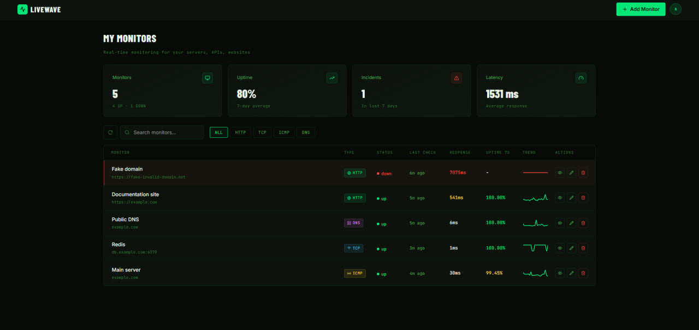
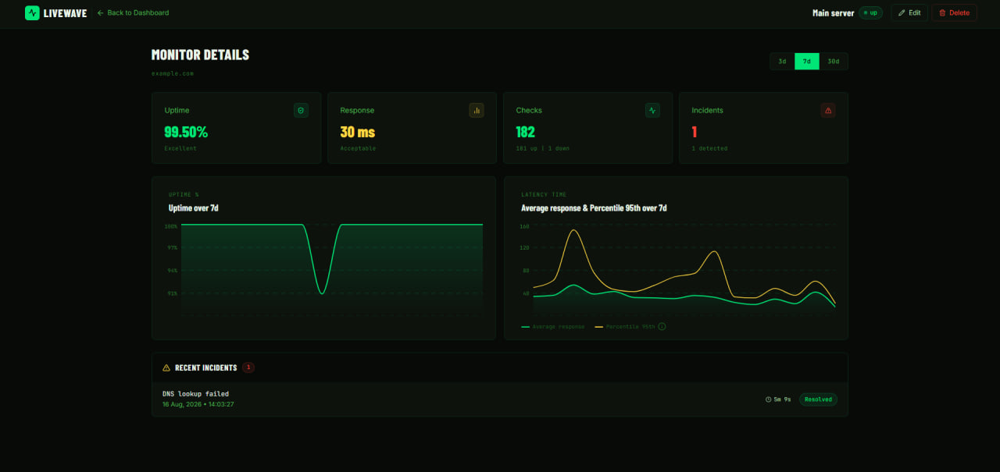
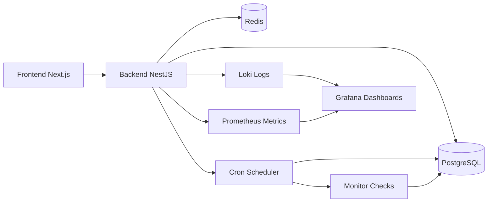

# LiveWave - Real-time uptime monitoring


**LiveWave** is a full‑stack monitoring platform for servers, APIs, and websites.  
It continuously checks uptime and performance, sends alerts via Telegram, and visualizes trends with rich dashboards

> **_Dashboard page:_**



> **_Monitor details page:_**



## Table of Contents

- [Architecture](#architecture)
- [Stack](#stack)
- [Features](#features)
- [Quick Start](#quick-start)
- [LiveWave Structure](#livewave-structure)

## Architecture



## Stack:

| Area               | Technologies                                                                                          |
| ------------------ | ----------------------------------------------------------------------------------------------------- |
| **Backend**        | NestJS, TypeScript, Prisma, PostgreSQL, Redis, Cron, Winston, Loki, Grafana, Prometheus, JWT, Swagger |
| **Frontend**       | Next.js, React, Tailwind CSS, TanStack Query, Zustand, Recharts                                       |
| **Observability**  | Grafana, Loki, Prometheus                                                                             |
| **Infrastructure** | Docker Compose, pnpm workspaces                                                                       |

---

## Features:

- **Real‑time checks** - monitor servers, APIs, websites with configurable intervals (5‑60 min)
- **Telegram integration** - OAuth via Telegram Widgets, link/unlink and notifications on status changes (up/down)
- **Secure authentication** - JWT with refresh/access tokens stored in `httpOnly` cookies + Redis validation
- **Optimistic UI** - instant feedback after `POST`/`PATCH`/`DELETE` for better UX

---

## Requirements:

- **Node.js** >= 22
- **pnpm** >= 11
- **Docker** and **Docker Compose** (for local infrastructure)

---

## Quick Start:

```bash
# 1. Clone the repository
git clone https://github.com/snowdelion/live-wave.git
cd live-wave

# 2. Install dependencies
pnpm install

# 3. Set up environment variables
cp backend/.env.example backend/.env.local
cp frontend/.env.example frontend/.env.local


# 4. Start infrastructure (PostgreSQL, Redis, Grafana, Loki, Prometheus)
pnpm docker

# 5. Setup database
pnpm db:generate   # Generate Prisma Client
pnpm db:push       # Push schema to database

# 6. Start development servers
pnpm dev
```

Once started, the services will be available at:

- Backend: `http://localhost:8000`
- Frontend: `http://localhost:3000`
- Swagger Docs: `http://localhost:8000/docs`
- Grafana: `http://localhost:3001`
- Prometheus: `http://localhost:9090`
- Loki: `http://localhost:3100`

---

## Available root scripts:

<details>
<summary><b>View all commands</b></summary>

### Development and Build

```bash
pnpm dev:backend      # Start backend in watch mode
pnpm dev:frontend     # Start frontend in watch mode
pnpm build:backend    # Build backend for production
pnpm build:frontend   # Build frontend for production
pnpm start:backend    # Start backend in production mode
pnpm start:frontend   # Start frontend in production mode
```

### Database

```bash
pnpm db:generate      # Generate Prisma Client
pnpm db:push          # Push schema changes to the database
pnpm db:studio        # Open Prisma Studio
```

### Testing and Quality

```bash
pnpm test             # Run frontend and backend tests in parallel
pnpm run validate     # Run TS check, Prettier, and ESLint for the backend and frontend
```

### Docker Compose

```bash
pnpm docker           # Build docker containers
pnpm docker:down      # Down docker containers and delete volumes
pnpm docker:restart   # Restart docker containers
```

</details>

---

## LiveWave Structure:

- `backend/` - NestJS application ([Backend README](./backend/README.md))
- `frontend/` - NextJS application ([Frontend README](./frontend/README.md))
- `observability/` - Grafana, Loki and Prometheus configs ([Observability README](./observability/README.md))
- `preview/` - screenshots for `README`
- `docker-compose.yml` - docker-compose config for local infrastructure

> _Global config files (`.eslintrc`, `.prettierrc`, `commitlint`, etc.) are placed at the root_

---

_This project is licensed - [MIT](./LICENSE)_
